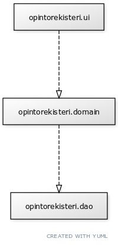
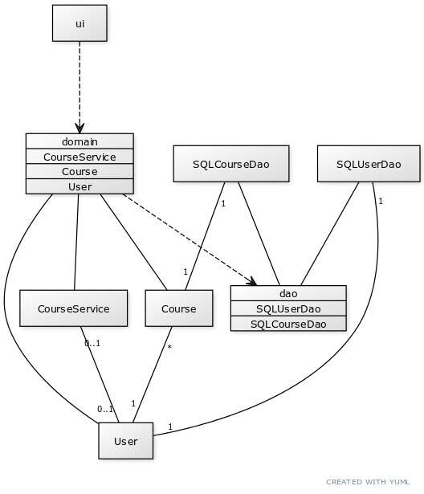

# Arkkitehtuurikuvaus

## Rakenne
Opintorekisteri-ohjelma noudattaa kolmitasoista kerrosarkkitehtuuria, joka on kuvattu alla:  
  

Pakkaus opintorekisteri.ui sisältää graafisen JavaFX käyttöliittymän, opintorekisteri.domain taas varsinainen sovelluslogiikan ja opintorekisteri.dao hoitaa tiedon pysyväistalletuksesta vastaavan koodin. Suhteita on kuvattu katkoviivoilla, koska muun muassa käyttöliittymäpakkaus tarvitsee tietoa sovelluslogiikan puolelta.  

  

Luokkakaavio Opintorekisteri-ohjelman luokista ja niiden välisistä suhteista. Ruudut joissa on lueteltu luokkien nimet kuvaavat ohjelman pakkauksia.

## Käyttöliittymä

## Sovelluslogiikka

## Tietojen pysyväistallennus
