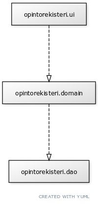
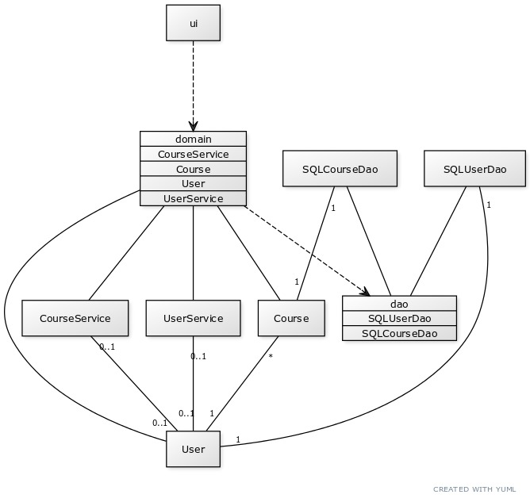
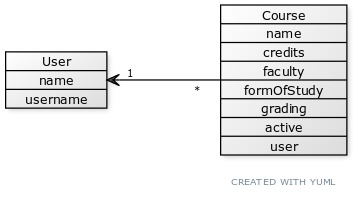
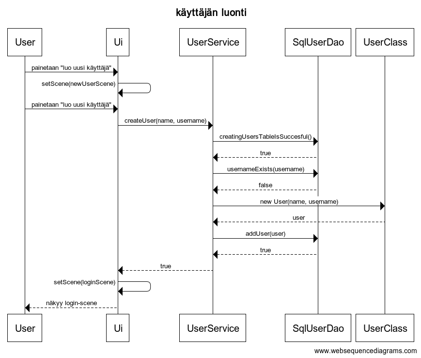
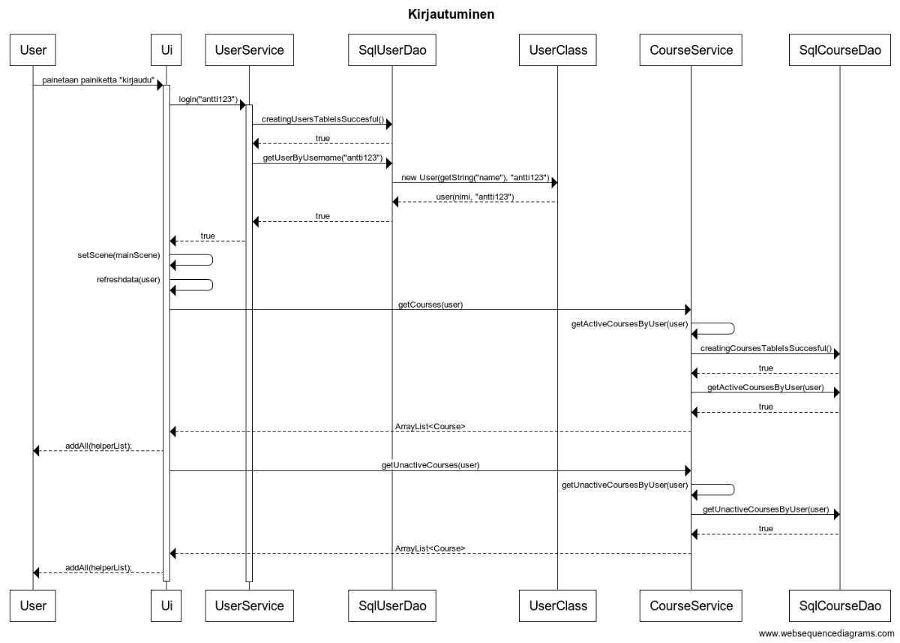
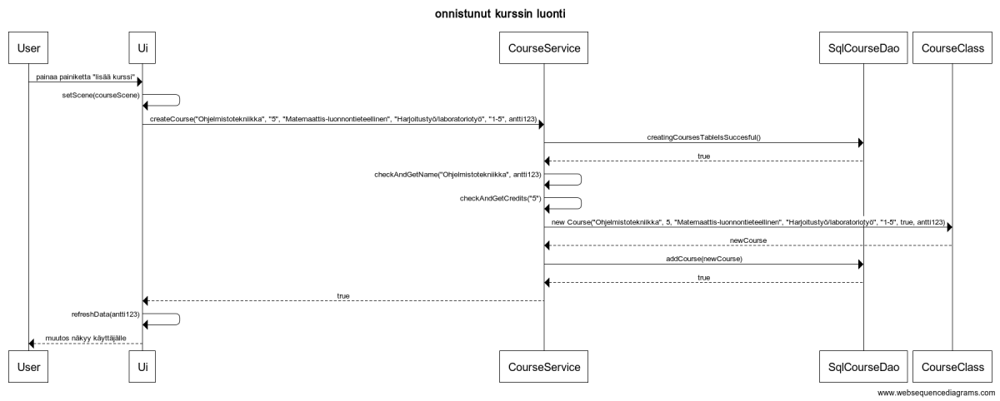
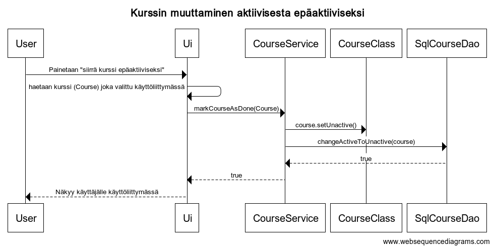
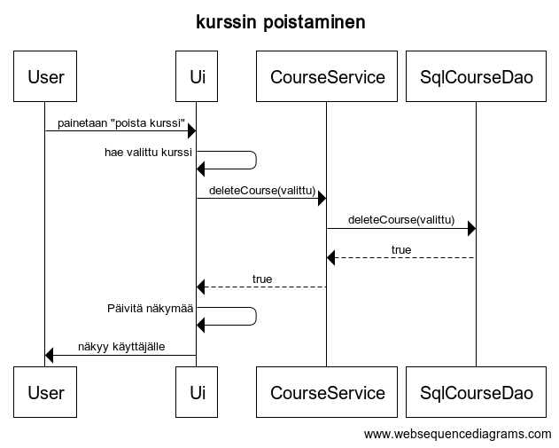

# Arkkitehtuurikuvaus

## Rakenne
Opintorekisteri-ohjelma noudattaa kolmitasoista kerrosarkkitehtuuria, joka on kuvattu alla:  
  

Pakkaus opintorekisteri.ui sisältää graafisen JavaFX käyttöliittymän, opintorekisteri.domain taas varsinainen sovelluslogiikan ja opintorekisteri.dao hoitaa tiedon pysyväistalletuksesta vastaavan koodin. 
Suhteita on kuvattu katkoviivoilla, koska muun muassa käyttöliittymäpakkaus tarvitsee tietoa sovelluslogiikan puolelta.  

  

Luokkakaavio Opintorekisteri-ohjelman luokista ja niiden välisistä suhteista. Ruudut joissa on lueteltu luokkien nimet kuvaavat ohjelman pakkauksia.

## Käyttöliittymä  
Käyttöliittymä sisältää neljä (4) erilaista näkymää:  
* Kirjautuminen
* Uuden käyttäjän luominen
* Kurssilista aktiivisista ja epäaktiivisista kursseista
* Kurssin tietojen syöttäminen ja lisääminen  

Näistä jokainen näkymä on toteutettu omana *Scene*-olionaan ja jokainen on yksi kerrallaan näkyvänä sijoitettu sovelluksen *Stage*-attribuuttiin. Käyttöliittymä on rakennettu ohjelmallisesti luokassa
 *opintorekisteri.ui.StudyRegisterUi*.  

Käyttöliittymä on pyritty eristämään täysin sovelluslogiikasta ja se kutsuu tarvittaessa *UserService* ja *CourseService* luokkien metodeja, jotka vastaavast sovelluslogiikasta sovelluksessa.  

Kun kirjautuneena olevan käyttäjän kursseihin tulee muutoksia, kutsutaan funktiota *refreshData*, joka hakee tietokannasta aina ajankohtaisen tiedon ja datan kirjautuneelle käyttäjälle.  

## Sovelluslogiikka
Sovelluksen loogisen datamallin muodostavat luokat *Course* ja *User*, jotka kuvaavat käyttäjiä ja käyttäjien kursseja:  

  
Lisäksi toiminnallisista kokonaisuuksita vastaa käyttäjän puolella luokka *UserService* ja kurssien puolella *CourseService*. *UserService*-luokan vastuulla on kaikki käyttäjiin liittyvä logiikka  muun muassa käyttäjän luominen ja kirjautumiseen liittyvät toiminnot. *CourseService*-luokan vastuulla on taas kaikki kursseihin liittyvä logiikka kuten kurssin luominen, poisto ja epäaktivointi.  

## Tietojen pysyväistallennus
Pakkauksen *opintorekisteri.dao* luokat *SqlUserDao* ja *SqlCourseDao* huolehtivat tietojen tallentamisesta tietokantaan. Käytössä on *SQLite3*-tietokanta, jossa on käytössä kaksi taulua ja tietokannan skeema
on [seuraavanlainen](kuvat/ot-ht-schema.pdf).  

Eli yksittäinen kurssi on liitetty yksittäiseen käyttäjään käyttäjätunnuksen perusteella ja käyttäjätunnus täytyy olla uniikki jokaiselle käyttäjälle. Kursseja voi olla useita kappaleita yhtä käyttäjää kohden.  

Tämän hetkisessä versiossa ohjelman tallettaa kaiken datan *courses.db*-nimiseen tiedostoon joka sijaitsee paikassa *Opintorekisteri/courses.db*.

## Päätoiminnallisuudet
Seuraavaksi kuvataan ohjelman päätoiminnallisuuksia sekvenssikaavioina.  

#### Käyttäjän luonti

  

Kaavio joka kuvaa uuden käyttäjän luomista onnistuneesti. Kun käyttäjä painaa "luo uusi käyttäjä"-painiketta login-scenessä, vaihtuu scene  newUser-sceneen. Tämän jälkeen kun uuden käyttäjän tiedot on syötetty ja painetaan "luo uusi käyttäjä"-painiketta, käyttöliittymä kutsuu UserService-luokan createUser()-metodia. UserService-luokka taas kutsuu SqlUserDao-luokan metodeja. Ensiksi katsotaan, että tietokanta on olemassa, jonka jälkeen katsotaan ettei käyttäjätunnus ole varattu jonka nimistä yritetään luoda. Jos edellä mainitut askeleet ovat OK, luodaan uusi User-olio ja sitten lisätään se SqlUserDao-luokan välityksellä tietokantaan. Sitten palataan takaisin käyttöliittymään jossa scene vaihtuu jälleen newUser-scenestä login-sceneen.

### Käyttäjän kirjautuminen

  

Kaavio joka kuvaan käyttäjän kirjautumista sovellukseen onnistuneesti. Kun painetaan "kirjaudu"-painiketta, UserService-luokka pyytää SqlUserDao-luokkaa tarkastamaan, että tietokanta on olemassa ja jos on niin sitten katsotaan onko käyttäjätunnus on olemassa. Sen jälkeen luodaan tiedoista uusi User-olio, jotta saadaan loggedIn-muuttujaan oikea käyttäjä. Sen jälkeen näkymä vaihtuu loginScenestä mainSceneksi. Sen jälkeen suoritetaan refreshdata()-kutsu, missä CourseService hakee SqlCourseDao-luokan avustuksella käyttäjätunnukseen liitetyt aktiiviset ja epäaktiiviset kurssit kirjautuneelle käyttäjälle. Sen jälkeen ne näytetään käyttöliittymän komponenteissa käyttäjälle. Tämän kaiken välissä tapahtuu myös kaikkea pientä, kuten käyttöliittymäkomponenttien luontia ja tekstikenttien tyhjennyksiä. Lisäksi oletetaan, että kaikki tapahtuu oikein, ei heitetä poikkeuksia tai tapahdu muuta outoa.  

### Kurssin luonti

  

Kaavio joka kuvaa uuden kurssin luomista onnistuneesti sovellukseen. Kun painetaan "lisää kurssi"-painiketta tapahtuu suunnilleen seuraavanlainen tapahtumaketju. Käyttöliittymäluokka kutsuu CourseService-luokan createCourse-metodia, jossa on mukana lisättävän kurssin tiedot ja tieto mille käyttäjälle kurssi kuuluu. Sen jälkeen CourseService pyytää SqlCourseDao-luokkaa tarkastamaan, että tietokanta on olemassa ja sen jälkeen suoritetaan CourseService-luokassa kurssin validointi, eli tutkitaan syötteet ja katsotaan, että samalla käyttäjällä ei ole samannimistä aktiivista kurssia. Näiden jälkeen luodaan uus kurssi ja lisätään se tietokantaan ja jälleen päivitetään kirjautuneen käyttäjän data ja näytetään se käyttöliittymässä käyttäjälle.  

### Kurssin muuttaminen aktiivisesta epäaktiiviseksi

  

Kaavio joka kuvaa tapahtumaketjua kun muutetaan aktiivisen kurssin status epäaktiiviseksi. Kun painetaan "siirrä kurssi epäaktiiviseksi"-painiketta, tapahtuu suunnilleen seuraavanlainen tapahtumaketju:
Haetaan käyttöliittymästä kurssi joka on sillä hetkellä valittuna. Se kurssi välitetään CourseService-luokalle ja sen markCourseAsDone-metodille. Sen jälkeen kutsutaan kurssi-olion omaa setUnactive()-metodia. Tämän jäkeen kutsutaan SqlCourseDao-luokan changeActiveToUnactive joka hoitaa tietokannan puolelta samat operaatiot, eli muuttaa statuksen aktiivisesta epäaktiiviseksi. Tämän jälkeen palataan takaisin käyttöliittymään, jossa suoritetaan muutamia operaatioita kuten poistetaan toisesta käyttöliittymäkomponentista valittu kurssi ja lisätään se toiseen.  

### Kurssin poistaminen

  

Kaavio joka kuvaa kun poistetaan sovelluksesta kurssi onnistuneesti. Kun painetaan "poista kurssi"-painiketta, käyttöliittymä hakee valitun Course-olion, välittää tiedon siitä CourseServicen deleteCourse-metodille joka taas välittää tiedon SqlCourseDao-luokan deleteCourse-metodille. Sitten palataan takaisin käyttöliittymään, jossa päivitetään käyttöliittymän näkymää käyttäjälle.  

## Ohjelman rakenteeseen jääneet heikkoudet  

## Käyttöliittymä  

Kaikki käyttöliittymän rakentava koodi on määritelty metodin *start*-sisällä. Tätä voisi refaktoroida esimerkiksi toteuttamalla jokaisen eri näkymän eli *scenen* luonti oman funktion sisään. Lisäksi näkymässä, jossa käyttäjä voi tutkia aktiivisia ja epäaktiivisia kurssejaan, olevat *Tableview*-komponentit voisi luoda jotenkin järkevämmin. Ne ovat melko *copy-paste*-menetelmällä tehdyt toistaiseksi. 

## DAO-luokat  

DAO-luokkia voisi refaktoroida jonkin verran, kuten esimerkiksi käyttämällä rajapintoja, jotta sovelluksen laajennettavuus ja testaaminen helpottuisi. Lisäksi koodi on jonkin verran toisteista ja noudattaa 
samaa kaavaa:
* Luo yhteys
  * jos null, palauta false
* kysely
  * jos poikkeus, palauta false
* palauta kyselyn tulos  

Voisi miettiä voisiko näitä jotenkin refaktoroida.  

Ohjelmasta voisi myös tehdä *parametreittain konfiguroitavan*. Tällä hetkellä ohjelmaan on kovakoodattu, että tietokanta luodaan hakemiston *Opintorekisteri* alle nimellä *courses.db*. Tähän voisi pohtia mahdollisuutta antaa käyttäjälle valta tiedoston nimeämisen ja sijainnin suhteen.
