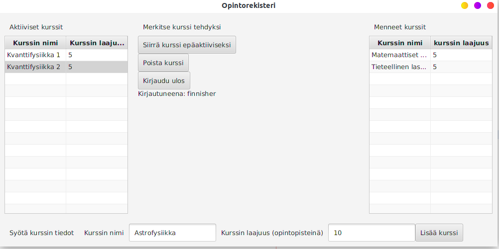
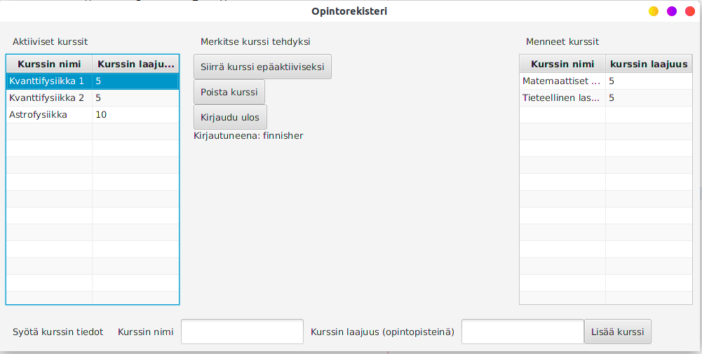
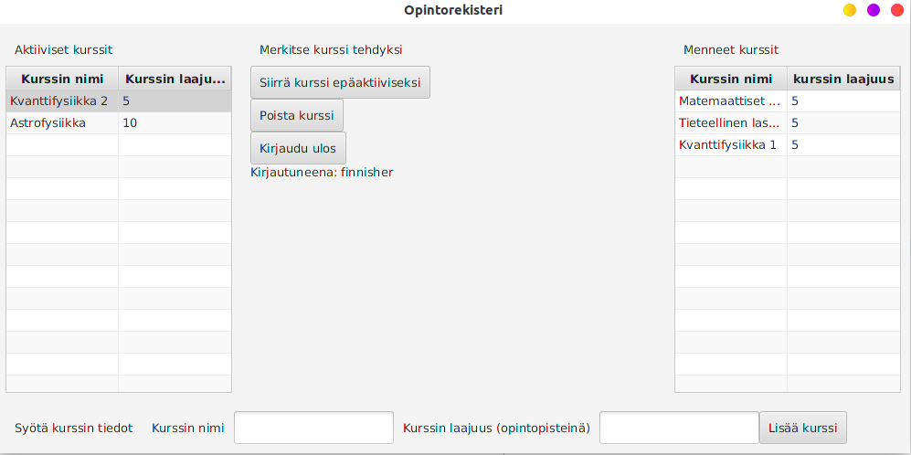

# Käyttöohje

## Konfigurointi

## Ohjelman käynnistäminen  
Oletetaan, että tietokoneelle on ladattu ohjelmasta uusin versio esimerkiksi GitHubin Releases paikasta. Tällöin ohjelma käynnistyy samassa hakemistossa ollessa komennolla `java -jar opintorekisteri-jar`.  

## Kirjautuminen  
Sovellus käynnistyy aluksi kirjautumisnäkymään:  
  
Kirjautuminen onnistuu kirjoittamalla tietokannassa olemassaoleva käyttäjätunnus syötekentään ja painamalla *Kirjaudu*. Lisäksi on tarjolla mahdollisuus sulkea ohjelma painamalla *Poistu*-painiketta. *Ohje*-painiketta painamalla avautuu pieni dialogi, joka tarjoaa pientä infoa ohjelmasta ja sen käytöstä.  
## Uuden käyttäjän luominen
Kirjautumisnäkymästä on mahdollista siirtyä uuden käyttäjän luomisnäkymään painamalla *Luo uusi käyttäjä*-painiketta jolloin avautuu seuraavanlainen näkymä:  
  
Uusi käyttäjä luodaan kirjoittamalla käyttäjätunnus ja nimi teksikenttiin ja painamalla *Luo uusi käyttäjä*. Jos luonti onnistuu, palataan takaisin edelliseen näkymään eli kirjautumisnäkymään. On myös mahdollisuus poistua näkymästä painamalla *Peruuta*.  
## Opintorekisterin käyttö  
Opintorekisterin ikkuna jossa tapahtuu kaikki päätoiminnallisuus näyttää seuraavalta:  
  
Ohjelman tarkoitus on, että käyttäjä voi pitää kirjaa aktiivisista ja menneistä opinnoistaan. Vasemmalla on aktiiviset kurssit ja oikealla menneet kurssit.
### Kurssin luonti  
Kurssi luodaan kirjoittamalla ikkunan alareunassa oleviin teksikenttiin kurssin tiedot (ks. ylempi kuva) ja painamalla *Lisää kurssi*, jolloin ne ilmestyvät "aktiiviset"-listaan (ks. alempi kuva).  
  

### Kurssin poisto  
Kurssi voidaan poistaa valitsemalla haluttu kurssi jommasta kummasta listasta ja painamalla *poista kurssi*.  
### Kurssin epäaktivointi
Aktiivinen kurssi voidaan muuttaa epäaktiiviseksi valitsemalla kurssi aktiivisten listasta ja painamalla *Siirrä kurssi epäaktiiviseksi*. Jos valitaan kurssi epäaktiivisista niin tulee virhedialogi.  

### Ohjelman lopetus  
Ohjelmasta voidaan kirjautua ulos painamalla *Kirjaudu ulos*. Lisäksi kirjautumisnäkymässä on vielä *Poistu*-painike joka sulkee ohjelman.
