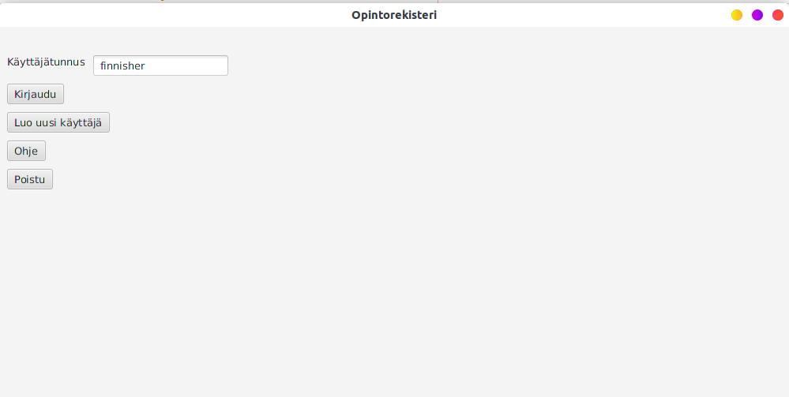

# Käyttöohje  

## Ohjelman käynnistäminen  
Oletetaan, että tietokoneelle on ladattu ohjelmasta uusin versio esimerkiksi [täältä](https://github.com/AlluSu/Ohjelmistotekniikka-ht/releases). Tällöin ohjelma käynnistyy komentoriviltä samassa hakemistossa ollessa komennolla `java -jar opintorekisteri.jar`.  
Vaihtoehtoinen ns. "hardcore"-tapa löytyy [täältä](https://github.com/AlluSu/Ohjelmistotekniikka-ht#ohjelman-ajaminen-komentorivilt%C3%A4)  

## Kirjautuminen  
Sovellus käynnistyy aluksi kirjautumisnäkymään:  
  
Kirjautuminen onnistuu kirjoittamalla tietokannassa olemassaoleva käyttäjätunnus syötekentään ja painamalla *Kirjaudu*. Lisäksi on tarjolla mahdollisuus sulkea ohjelma painamalla *Poistu*-painiketta. *Ohje*-painiketta painamalla avautuu tämä sivu selaimessa.  
## Uuden käyttäjän luominen
Kirjautumisnäkymästä on mahdollista siirtyä uuden käyttäjän luomisnäkymään painamalla *Luo uusi käyttäjä*-painiketta jolloin avautuu seuraavanlainen näkymä:  
  
Uusi käyttäjä luodaan kirjoittamalla käyttäjätunnus ja nimi teksikenttiin ja painamalla *Luo uusi käyttäjä*. Jos luonti onnistuu, palataan takaisin edelliseen näkymään eli kirjautumisnäkymään. On myös mahdollisuus poistua näkymästä painamalla *Peruuta*.
    
Ylläolevassa kuvassa näkyy kirjautumisnäkymän ilmoitus joka ilmestyy jos käyttäjän luonti onnistui.    
## Opintorekisterin käyttö  
Opintorekisterin ikkuna jossa tapahtuu kaikki päätoiminnallisuus näyttää seuraavalta:  
  
Ohjelman tarkoitus on, että käyttäjä voi pitää kirjaa aktiivisista ja menneistä opinnoistaan. Vasemmalla on aktiiviset kurssit ja oikealla menneet kurssit. Vasemmalla alakulmassa näkyy kirjautunut käyttäjä.  
### Kurssin luonti  
Kurssi luodaan painamalla *Lisää kurssi*-painiketta, jolloin avautuu uusi *scene* eli kurssin luonti näkymä.  
  
Kurssista talletetaan ylläolevassa kuvassa olevat tiedot eli nimi, laajuus, tiedekunta, suoritustapa ja arvosteluasteikko. Jos jokin kenttä jää täyttämättä tai valitsematta tai on annettu virheellinen arvo,  niin siitä ilmoitetaan. Jos kurssin luonti onnistuu niin siitä ilmoitetaan tekstillä.  
  
Onnistuneen lisäyksen jälkeen käyttäjää ei automaattisesti uudelleenohjata päänäkymään vaan käyttäjän täytyy itse siirtyä sinne painamalla *Peruuta*. 
### Kurssin poisto  
Kurssi voidaan poistaa valitsemalla haluttu kurssi jommasta kummasta listasta ja painamalla *poista kurssi*.
    
  
Ylläolevissa kuvissa on poistettu kurssi *Astrofysiikka* aktiivisista kursseista.  

### Kurssin epäaktivointi
Aktiivinen kurssi voidaan muuttaa epäaktiiviseksi valitsemalla kurssi aktiivisten listasta ja painamalla *Siirrä kurssi epäaktiiviseksi*. Jos valitaan kurssi epäaktiivisista niin tulee virhedialogi.  
  
  
Ylläolevissa kuvissa *Johdatus logiikkaan 1*-kurssi on siirretty aktiivisesta epäaktiiviseksi.  
### Ohjelman lopetus  
Ohjelmasta voidaan kirjautua ulos painamalla *Kirjaudu ulos*. Lisäksi kirjautumisnäkymässä on vielä *Poistu*-painike joka sulkee ohjelman.
