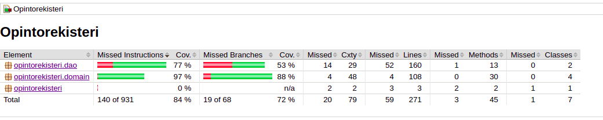

# Testausdokumentti  

Ohjelmaa on testattu yksikkö- ja integraatiotestein JUnitilla sekä manuaalisesti järjestelmätason testein.  

## Yksikkö- ja integraatiotestaus  
 
### sovelluslogiikka  
Integraatiotestit ovat testiluokat *CourseServiceCourseTest* ja *UserServiceUserTest*. Ne simuloivat pakkauksen *opintorekisteri.domain* sovelluslogiikkaa, jota *CourseService*- ja *UserService*-luokat suorittavat. Tällä hetkellä ei ole valitettavasti käytössä mitään erillistä  testitietokantaa, vaan testit suoritetaan samaan tietokantaan mihin talletetaan oikeakin data.  
*User*- ja *Course*-luokille on suoritettu pari pientä yksikkötestiä. 
### DAO-luokat
DAO-luokkien testaus tapahtuu samalla kun testataan domain-luokkia, koska testit käyttävät samaa tietokantaa eikä testitietokantaa.  
### Testauskattavuus  
Käyttöliittymä on jätetty pois testikattavuudesta.
  
Rivikattavuus siis 84% ja haarautumakattavuus 72%.  
Testaamatta jäivät tilanteet, missä tietokantayhteyttä ei voida muodostaa tai se heitetään poikkeus. Jos käytössä olisi ollut jonkinlainen testitietokanta niin nämä olisi luultavasti saatu katettua täysin, jolloin testikattavuus olisi lähennellyt 100%.  
## Järjestelmätestaus
Järjestelmätestausta on tehty manuaalisesti etätyöpöytä-sovelluksella Linux-ympäristössä.  
### Asennus ja konfigurointi  
Kuten edellä mainitsin, sovellusta on testattu etätyöpöytä-sovelluksessa ja se on asennettu käyttöohjeen mukaan. Käytössä on ollut vain Linux-ympäristö, missä sovellus on suunniteltu alunperin toimivaksi.  
Sovellusta on testattu tyhjällä tietokannalla ja tietokannalla jossa on jo dataa.
### Toiminnallisuudet
Sovelluksen kaikki toiminnallisuudet on testattu parhaan mukaan. Ylimääräiset välilyönnit tekstikentissä saattavat aiheuttaa päänvaivaa kuten bugeja ja käytettävyysongelmia. Esimerkiksi tällä hetkellä menee läpi käyttäjätunnus, jossa on pelkästään 3 välilyöntiä tai enemmän. Jätetään käyttäjälle toistaiseksi vastuu, että ei anneta järjettömiä nimiä.
## Sovellukseen jääneet laatuongelmat  
Kuten edellä mainittu, ei ole testattu tilanteita, jossa tietokannan luonti ei onnistu. Lisäksi pidemmän päälle testien suorittaminen oikeaan tietokantaan ei ole järkevää.  
