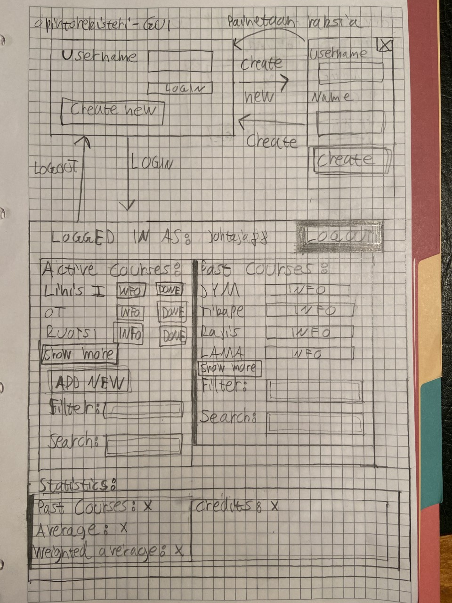
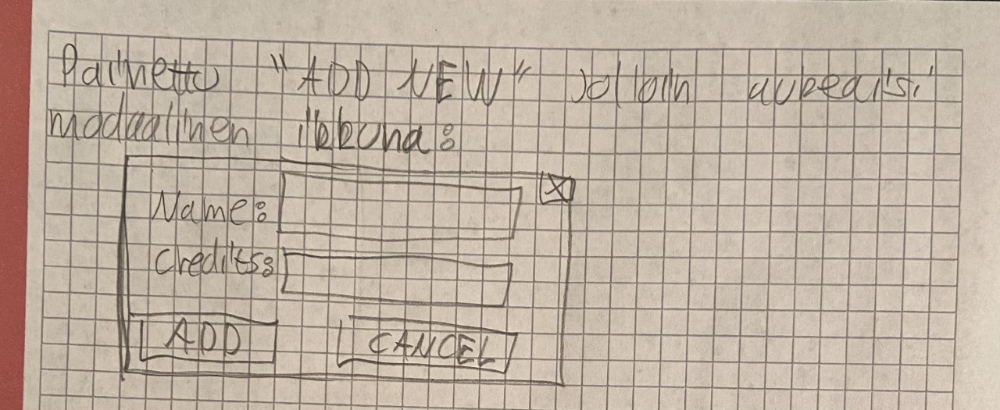

# Vaatimusmäärittely

## Sovelluksen tarkoitus  
Sovelluksen tarkoitus on olla opintojen seurantajärjestelmä. Sovellusta voi käyttää usea käyttäjä kirjautumalla aina omilla tunnuksillaan sovellukseen.

## Käyttäjät
Aluksi sovelluksessa on vain yhdenlaisia käyttäjiä eli normaaleita käyttäjiä. Ajan puitteissa voitaisiin lisätä myös isommilla oikeuksilla varustettuja Admin-käyttäjiä. Adminit pystyisivät muun muassa
esimerkiksi poistamaan  muita käyttäjiä.

## Käyttöliittymäluonnos

Ensimmäisessä kuvassa on käyttöliittymä-luonnokset kirjautumisesta, uuden käyttäjän luomisesta ja näkymästä kun käyttäjä on kirjautunut onnistuneesti.  
Toisessa kuvassa on luonnos millainen modaalinen ikkuna avautuu kun painetaan painiketta "ADD NEW".  

# Perusversion tarjoama toiminnallisuus

## Ennen kirjautumista
* Käyttäjä voi luoda sovellukseen käyttäjätunnuksen
  * Käyttäjätunnuksen täytyy olla uniikki, järjestelmä ilmoittaa onko käyttäjä varattu vai ei  
  * Käyttäjätunnuksen täytyy olla vähintään kolme (3) merkkiä pitkä  
  * Nimen täytyy olla vähintään kolme (3) merkkiä pitkä  

* Käyttäjä voi kirjautua järjestelmään
  * Jos kirjautuminen ei onnistu, niin siitä ilmoitetaan  

## Kirjautumisen jälkeen
* Käyttäjä näkee omat aktiiviset kurssinsa  
* Käyttäjä voi lisätä uuden kurssin aktiivisten kurssien listaan  
* Käyttäjä voi merkitä aktiivisen kurssin epäaktiiviseksi jolloin se muuttuu menneeksi kurssiksi  
* Käyttäjä näkee menneet kurssinsa  
* Käyttäjä voi poistaa aktiivisen tai menneen kurssin listasta  
* Käyttäjä voi kirjautua ulos järjestelmästä
# Jatkokehitysideoita
* Salasana kirjautumisen yhteyteen
* Mahdollisuus käyttäjän ja käyttäjätietojen poistoon
  * Admin-käyttäjä järjestelmään
* Statistiikkaa kursseista ja opinnoista. Esimerkiksi:
  * suoritettujen opintojen keskiarvo
  * opintopistelaskuri
* Aktiivisten ja menneiden kurssien hakeminen listasta hakukentän avulla
* Kursseihin lisää tietoa. Esimerkiksi:  
  * Mahdollisuus merkitä kurssit jaksottain tai aloituspäivämäärä ja lopetuspäivämäärä
  * Mahdollisuus merkitä saamansa arvosana sen jälkeen kun kurssi on siirretty aktiivisesta epäaktiiviseksi, jotta saa kerättyä edellämainittua statistiikkaa  
* Käyttöliittymän ja samalla UI/UX-alueiden parantaminen, kuten selkeämmät virheilmoitukset, käyttöliittymän komponenttien parempi asemointi ym.
